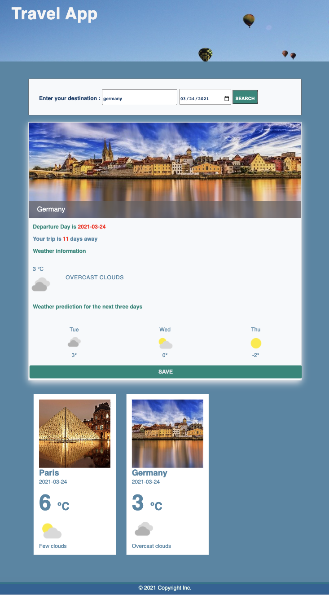

# Project overview

The Travel app is a  the final capstone project for Udacity's Front End Web Developer Nanodegree program. This project aims to give us the opportunity to put all of the skills that we learned into one project to build our own custom travel app.



# Project Instructions


The goal of this project is to give you practice with:
- Setting up Webpack
- Sass styles
- Webpack Loaders and Plugins
- Creating layouts and page design
- Service workers
- Using APIs and creating requests to external urls


## Getting started

`cd` into your new folder and run:
- `npm install`

## Setting up the API

### Step 1: Signup for an API key
First, you will need to go [here](https://developer.aylien.com/signup). Signing up will get you an API key. Don't worry, at the time of this course, the API is free to use up to 1000 requests per day or 333 intensive requests. It is free to check how many requests you have remaining for the day.

### Step 2: Environment Variables
Next we need to declare our API keys, which will look something like this:
```
API_ID=**************************
API_KEY=**************************
```

```
const dotenv = require('dotenv');
dotenv.config();
```
- [ ] Reference variables you created in the .env file by putting ```process.env``` in front of it, an example might look like this:
```
console.log(`Your API key is ${process.env.API_KEY}`);
```
```

### Step 3 : Using the API

We're ready to go! The API has a lot of different endpoints 
- Parse the response body to dynamically fill content on the page.
- Test that the server and form submission work, making sure to also handle error responses if the user input does not match API requirements.

- Go back to the web pack config and add the setup for service workers. 
- Test that the site is now available even when you stop your local server

## Deploying

A great step to take with your finished project would be to deploy it!  
